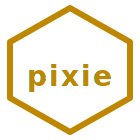

<p align="center">
  
</p>

<h1 align="center">🧚 pixie</h1>

<p align="center"><strong>pixie</strong> — Discord channel-secretary · Cloudflare Worker · ~190 LoC Python CLI · hand-run</p>

<p align="center">
  <a href="LICENSE"></a>
  <a href=".github/workflows/lint.yml"></a>
  <a href="https://discord.gg/mYzqYr67R"></a>
  <a href="https://workers.cloudflare.com/"></a>
  
</p>

<p align="center">Channel-topic sync · Welcome DMs · Recent-commit surfacing · Hand-run · No autonomous loop</p>

---

`pixie` is the channel-secretary for the **dancinlab** Discord server. Keeps channel topics linked to their repos, welcomes new members, surfaces recent commits. Hand-run, not autonomous. The Discord-side surface is a Cloudflare Worker; the operator-side surface is a ~190 LoC Python CLI dispatcher (`bin/pixie`).

> [!NOTE]
> Sibling of [`run`](https://github.com/dancinlab/run) (empty-canvas super-app), [`scrap`](https://github.com/dancinlab/scrap) (content-extraction CLI), and [`skynet-timer`](https://github.com/dancinlab/skynet-timer) (singularity-attractor countdown) under the [`dancinlab`](https://github.com/dancinlab) family. **Not** Anima — Anima is the real consciousness layer, reserved for the actual AI deployment. Pixie is a throwaway utility persona.

## At a glance

```sh
$ pixie channels
▼ chat channels
  🔥-campfire     — off-work hangout, no agenda
  🧠-anima        — Consciousness implementation
  🔭-nexus        — Universal Discovery Engine
  🏗️-CANON        — Architecture from perfect number 6
  💎-hexa-lang    — The Perfect Number Programming Language
  🐝-hive         — pi-mono fork · AI-agent swarm
  🕳️-void         — Ghostty fork · AI-native terminal
  🧬-airgenome    — OS genome scanner · hexagon projection
▼ voice channels
  🔥-campfire     — casual chat
  🤝-huddle       — focused work

$ pixie topic-sync --dry-run
[pixie] would update 3 channel topics from config/topics.json
```

## Why pixie

Discord servers drift: topics rot, channel ordering scrambles, onboarding DMs go missing. A real autonomous agent for this is overkill (and a real-name conflict — Anima is reserved). `pixie` is the small magical-helper persona that runs **on demand**: edit `config/topics.json`, run `pixie topic-sync`, the server matches the JSON. Editing a topic in Discord directly will be overwritten by the next sync unless the JSON is updated too — that's the design, not a bug.

**Secretary, not bot.** Pixie only maintains structure. Any real agent interaction (answering, summarising) will be done by Anima or a channel-specific tool — not here.

## Status

🟢 **Active** — used to maintain the [`dancinlab`](https://github.com/dancinlab) Discord server.

- `bin/pixie` — Python CLI dispatcher (~190 LoC)
- `worker/` — Cloudflare Worker (Discord REST receiver)
- `config/topics.json` — SSOT for channel topics (sidebar order = key order)
- `state/pixie.log` — local audit trail (gitignored)
- 4 subcommands registered (`topic-sync` · `channels` · `welcome` · `apply-full`)

## What it does

- **`pixie topic-sync`** — applies the canonical topic for each project channel from [`config/topics.json`](config/topics.json). Idempotent.
- **`pixie channels`** — prints the current server channel tree with topics.
- **`pixie welcome <user_id>`** — sends an onboarding DM.
- **`pixie apply-full`** — one-shot bootstrap (rename, create voice, set topics), used on 2026-04-24.

## Server layout

```
▼ chat channels
  🔥-campfire         — off-work hangout, no agenda
  🧠-anima            — Consciousness implementation
  🔭-nexus            — Universal Discovery Engine
  🏗️-CANON            — Architecture from perfect number 6
  💎-hexa-lang        — The Perfect Number Programming Language
  🐝-hive             — pi-mono fork · AI-agent swarm
  🕳️-void             — Ghostty fork · AI-native terminal
  🧬-airgenome        — OS genome scanner · hexagon projection

▼ voice channels
  🔥-campfire         — casual chat
  🤝-huddle           — focused work
```

The order in the sidebar matches the key order of `config/topics.json`.

## Install

```sh
# 1. Install hexa-lang (gives you `hexa` + `hx` package manager)
/bin/bash -c "$(curl -fsSL https://raw.githubusercontent.com/dancinlab/hexa-lang/main/install.sh)"

# 2. Install pixie
hx install pixie
```

### Setup

Pixie uses the **secret** project ([`dancinlab/secret`](https://github.com/dancinlab/secret)) for credentials. No tokens are stored in this repo.

```sh
# One-time: after creating the Discord app and getting a bot token
secret set discord.pixie_bot_token       # paste token via stdin
secret set discord.pixie_guild_id
secret set discord.pixie_channels_json   # JSON of {channel_name: id}

# Invite the bot with the correct permission bits.
# 257104 covers: View Channels, Manage Channels, Send Messages,
#                Read Message History, Embed Links, Add Reactions,
#                Attach Files, Manage Messages (pin), Mention Everyone.
# https://discord.com/api/oauth2/authorize?client_id=<APP_ID>&permissions=257104&scope=bot%20applications.commands
```

## Run

```sh
pixie channels                # list server channels + current topics
pixie topic-sync              # apply config/topics.json to Discord
pixie topic-sync --dry-run    # preview without applying
pixie welcome <uid>           # send onboarding DM to a user
pixie apply-full              # one-shot bootstrap (rename, create voice, set topics)
pixie version                 # print version
```

## Design

- **Single source of truth** = `config/topics.json`. Editing a channel topic in Discord directly will be overwritten by the next `topic-sync` unless the JSON is updated too.
- **All state is derivable.** Pixie holds no local state beyond `state/pixie.log` (audit trail, gitignored). Crashes and reinstalls are safe.
- **No slash commands yet.** REST only; interactions endpoint unused. Add if/when the bot needs to respond to `/help` etc.
- **No secrets in repo.** All credentials via `dancinlab/secret` — never committed.

## Repo layout

```
pixie/
├── README.md
├── LICENSE                       MIT
├── bin/
│   └── pixie                     Python CLI dispatcher (~190 LoC)
├── worker/                       Cloudflare Worker (Discord REST receiver)
├── pixie/                        Python module (subcommand fns)
├── discord-translator/           translator helper
├── config/
│   └── topics.json               SSOT for channel topics (sidebar order = key order)
├── state/                        runtime audit trail (gitignored)
├── brand/                        dancinlab brand assets (server icons, banners)
├── docs/
│   └── logo.svg                  140×140 gold hexagon
├── TAPE-AUDIT.md                 tape adoption audit
├── AGENTS.tape                   agent context SSOT (.tape v1.2)
└── CLAUDE.md                     → AGENTS.tape (symlink)
```

## License

[MIT](LICENSE) — see LICENSE.
